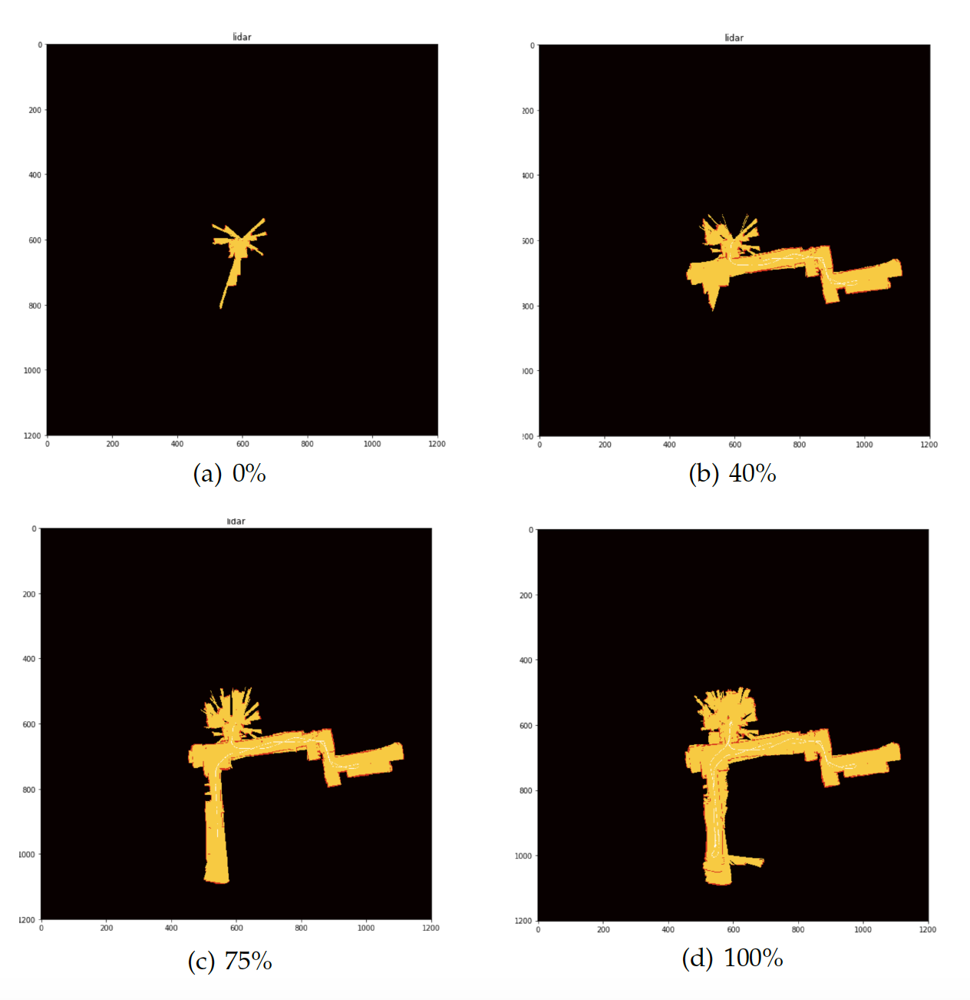
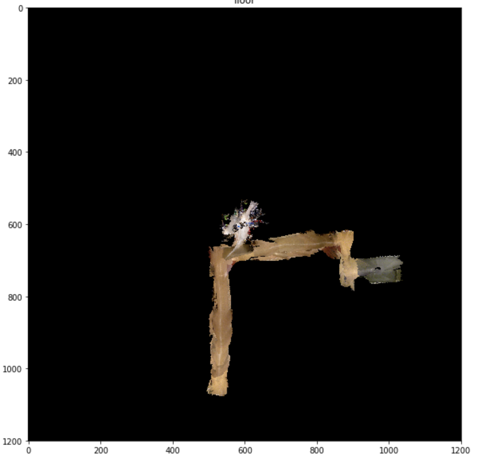

# Author
Shiming Luo 

# Brief Description (简要说明)：
This is a SLAM (Simultaneous Localization And Mapping) project. It is going to use odometry, inertial, 2-D laser range, and RGBD measurements to localize a differential-drive robot and build a 2D occupancy grid map. Furthermore, floor texture would be given to the 2D map by utilizing the measurement obtained from RGBD cameras on robot.

----------------------------------------------------------------------------


这是一个基于粒子滤波器的SLAM（即时定位与地图构建）项目。它将会用到测量、惯性、2维激光，和RGBD测量来定位一个差分驱动机器人，并建立一个2维地图。此外，利用机器人上RGBD摄像机的测量结果，给出了2维地图的地面纹理。

# Dataset （数据集）：
**Encoder**: Differential Drive Control Input

**Hokuyo**: 2D Lidar Data

**Imu**: Inertial Data (linear acceleration & angular velocity)

**Kinect**: Kinect time stamps

**RGBD**: not applied yet


----------------------------------------------------------------------------


**Encoder**: 机器人差分驱动输入

**Hokuyo**: 2D雷达数据

**Imu**: 惯性数据（线加速度 & 角速度）

**Kinect**: Kinect时间戳

**RGBD**: 尚未上传


# Usage （用法）：
To simply run 
```bash
$ python3 main.py
```
we could get the result of dataset20. You could change the variable "dataset" in main.py to switch the dataset (remember to set the "TEXTURE" to False when use dataset23).

"COUNT": determine the number of particles

This python file main take 30mins to obtain a result with texture.

----------------------------------------------------------------------------


可以直接运行
```bash
$ python3 main.py
```
改变 main.py 中的 dataset 的变量可以改变我们使用的数据集。

p.s. 

由于RGBD数据过大（～2GB），将不直接上传在github上，将来会以别的形式上传（暂时在运行 main.py 时请将 TEXTURE 设为 False）。

“COUNT”： 粒子滤波器的粒子数量。


# Demo Result （Demo效果）
Result of dataset20 （基于dataset20的运行效果）：

1. Mapping （绘制地图）


1. Texture （地面上色）

